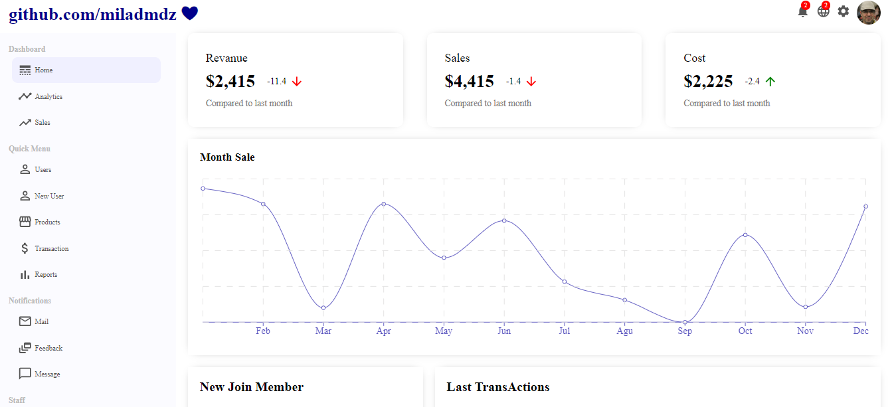
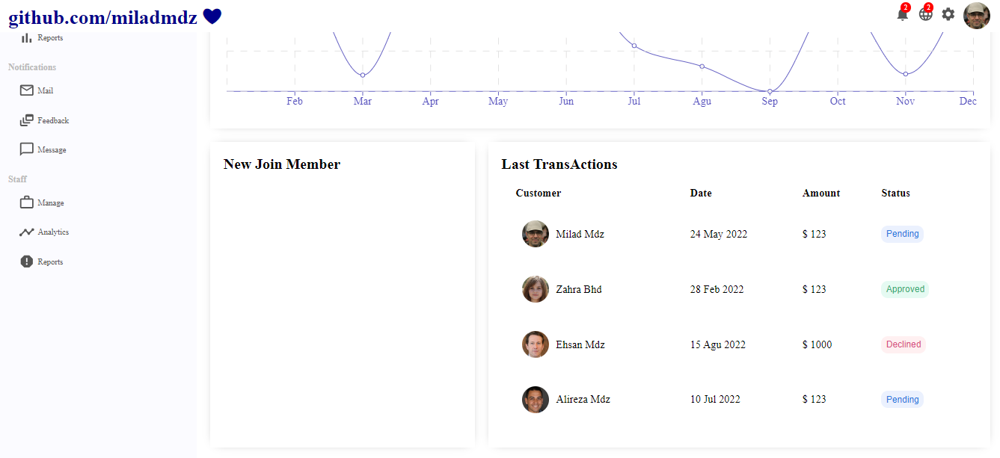
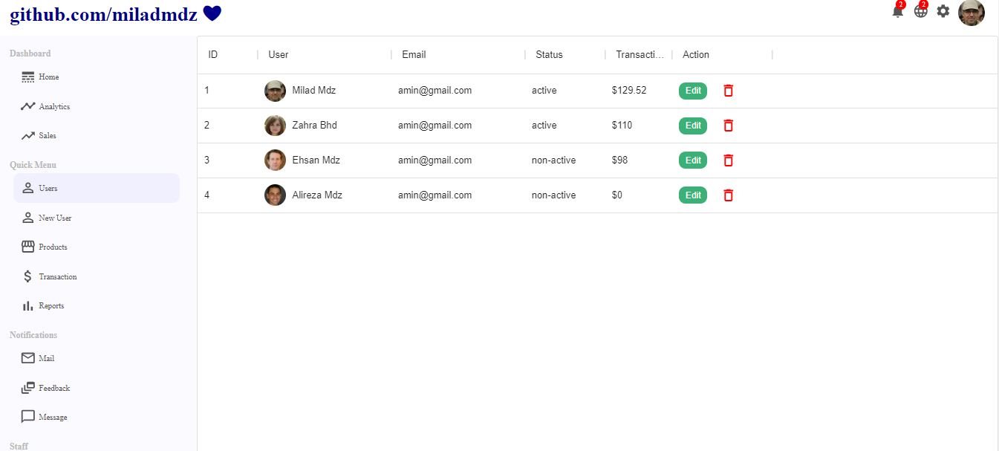
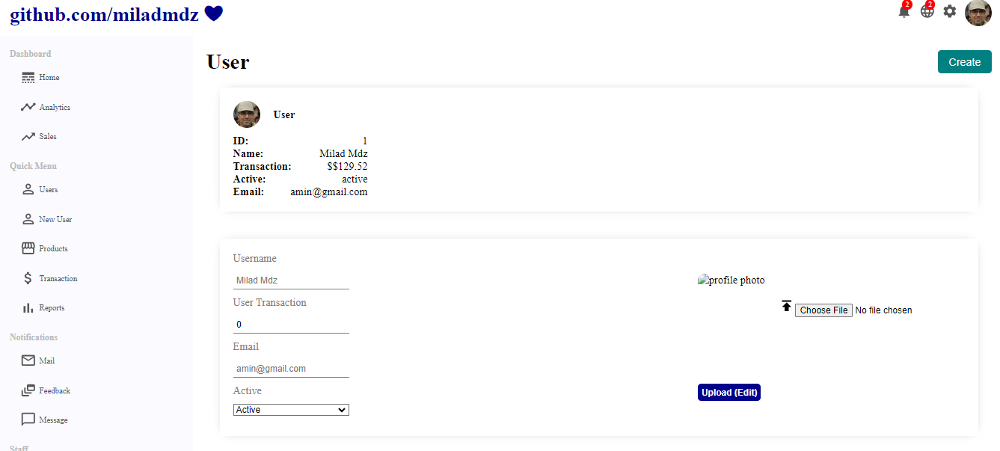
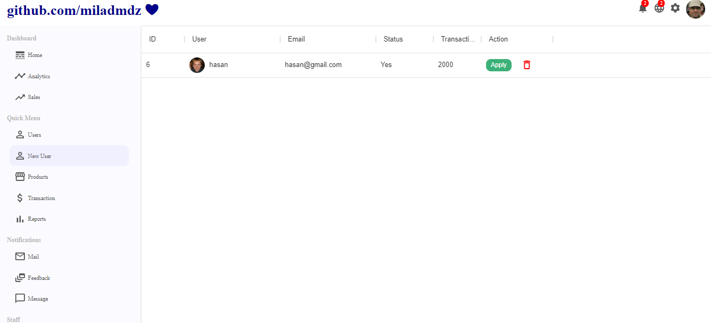
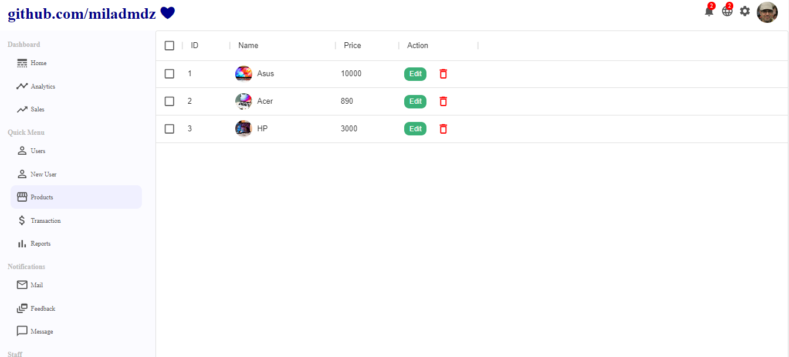
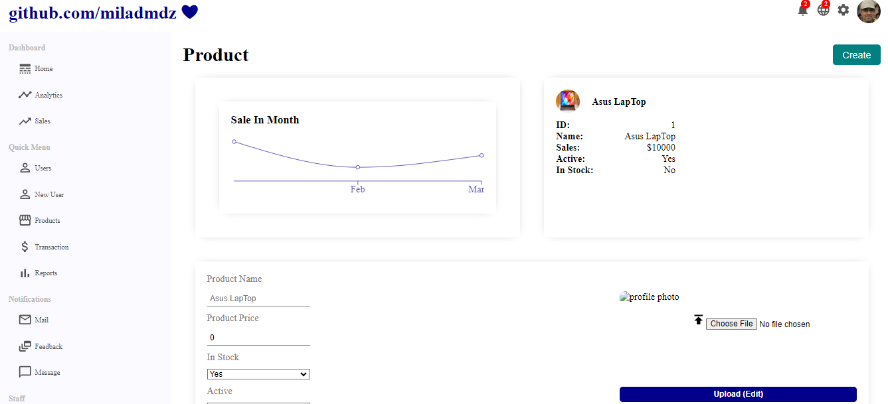

# Mini Project Dashboard Admin :

Admin dashboard mini project, which is part of Home and Products and Users and New Users, which is built with React framework and is a single package application (spa) and is only active for desktop and laptop dimensions. The purpose of this project is to show how to learn Ricketts, that's why it is not responsive🤞😉

 

Also, packages of React Router Dom and Material UI (MUI) and Recharts have been used

## this project make with:

## Demo:

